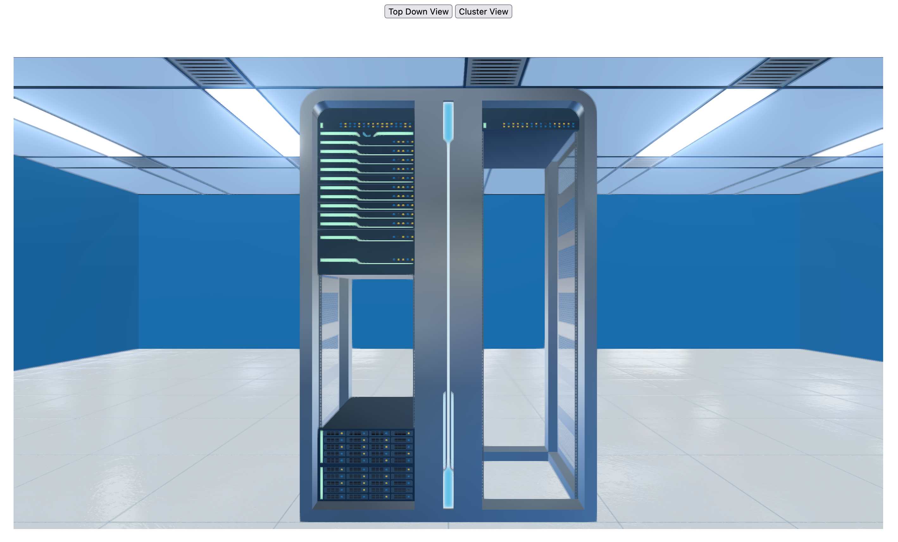

# Flight Virtual Data Centre Example

For testing [Flight VDC Core](https://github.com/openflighthpc/flight-vdc-core).

## Setup 

```
# Initialise VDC library
git submodule init

# Install Web App Dependencies
bundle install
ruby vdc.rb
```

Visit http://localhost:4567 and see the following:


## Features

- Viewing clusters by clicking them (when label appears that confirms that a rack has been "hovered" and is therefore clickable)
- Return to top down view with helper button
- Turning nodes on and off (right-click on them and select start/stop depending on current status) 
- Moving nodes to new slots in a rack (click on a node to unrack it, click in another slot to rerack it) 
- Cluster name shown on rack hover (in top-down view)
- Node name shown on node hover (in cluster view) 
- Zoom in with mouse wheel (quite dodgy, not recommended) 
- Dynamically reloading node layout (any changes to `room.yml` are reflected in front-end session, checked every 10s) 
- Display data overviews for currently selected cluster with button (does nothing in top-down view)
