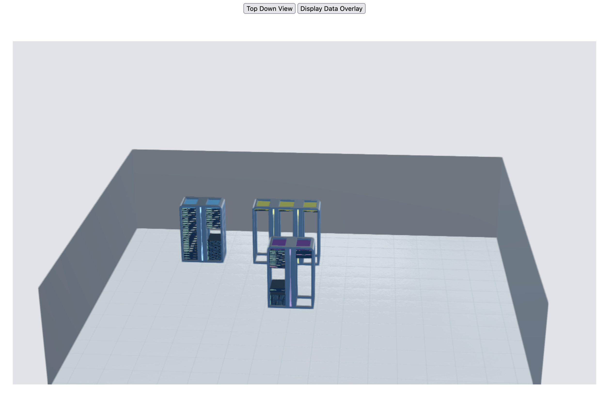

# Flight Virtual Data Centre Example

For testing [Flight VDC Core](https://github.com/openflighthpc/flight-vdc-core).

```
# Initialise VDC library
git submodule init

# Install Web App Dependencies
bundle install
ruby vdc.rb
```

Visit http://localhost:4567/index.html and see the following:

